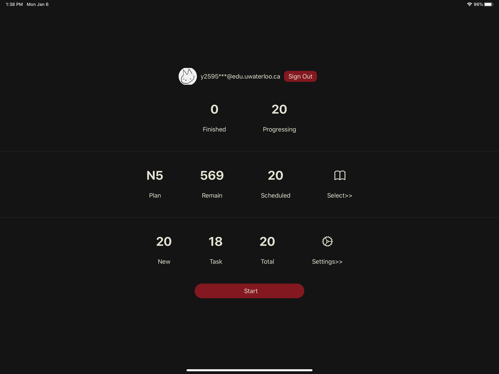
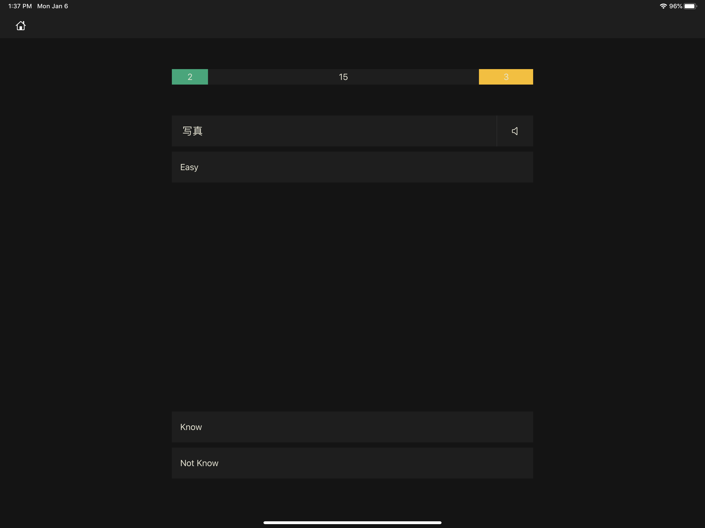
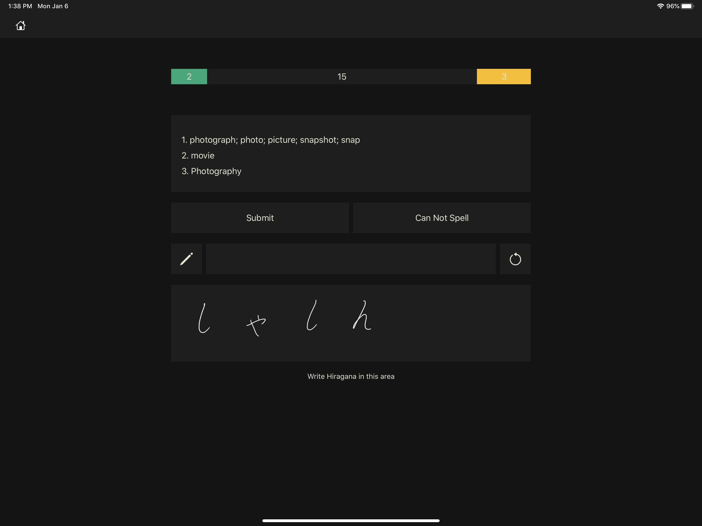
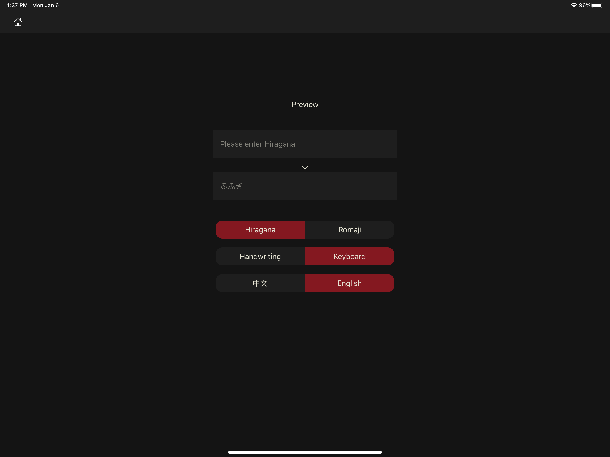
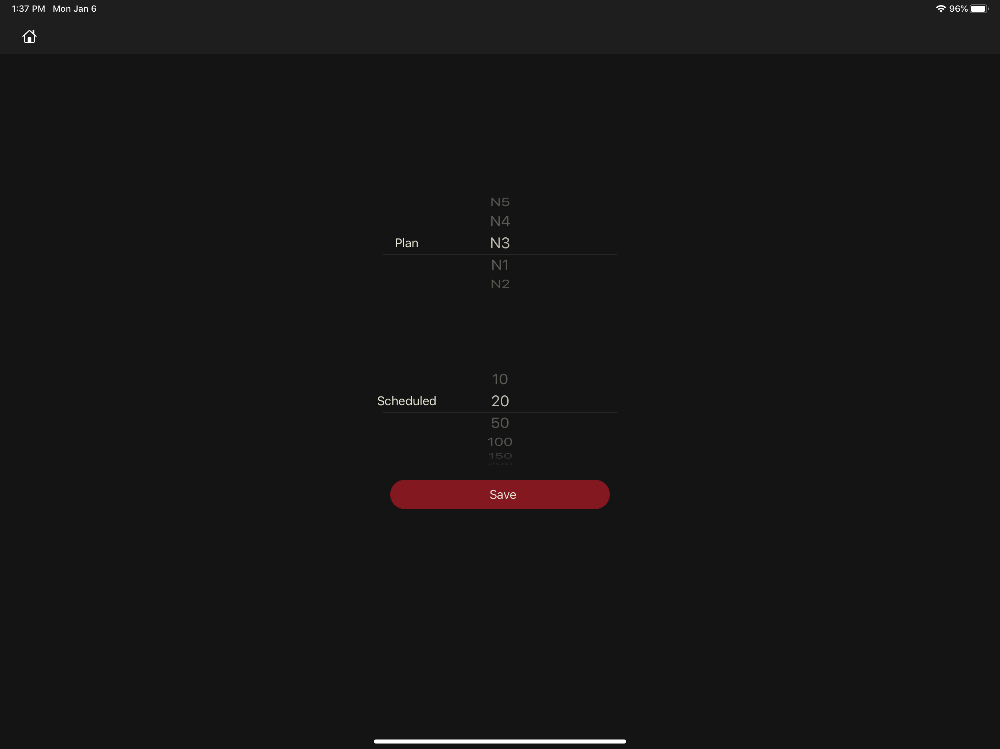

<br />
<p align="center">
  <a href="https://github.com/Clavier-Zhang/AWSL-Japanese">
    
  </a>
  <h3 align="center">AWSL Japanese</h3>
  <p align="center">
    A flash-card app that helps you to memorize Japanese vocabulary
    <br />
    <a href="https://apps.apple.com/us/app/awsl-japanese/id1492610472"><strong>Download at App Store - Apple</strong></a>
    <br />
    <br />
  </p>
</p>


## Table of Contents

- [Table of Contents](#table-of-contents)
- [About the Project](#about-the-project)
- [Previews](#previews)
  - [Dashboard](#dashboard)
  - [Study Steps](#study-steps)
  - [Settings](#settings)
- [Getting Started](#getting-started)
  - [Prerequisites](#prerequisites)
  - [Installation](#installation)
- [Usage](#usage)


<!-- ABOUT THE PROJECT -->
## About the Project

This app is made for me to learn Japanese. When I was learning English, many great apps are suitable for me. However, when it comes to Japanese, I can hardly find an ad-free, easy-to-use app to learn Japanese vocabularies. So I decided to make my app with following features.

* Support learning Japanese with both Chinese and English meanings. Include Japanese N1 to N5, over 5,000 core vocabularies with examples and audio.
  
* Based on your performance on each flashcard, the algorithm behind this app decides the best timing for the next review. Those challenging words will frequently appear until you are not forgetting anymore. With the help of Forgetting Curve, your learning efficiency is optimized.
  
* Multiple quiz modes to evaluate your learning. You can write done Hiragana using the Apple Pencil, and your handwriting will be compared with the correct solution for each flashcard. Also, you can use a keyboard and type Hiragana or Romaji as your answers.
  
* Your progress will be displayed on the dashboard.
  
* Support offline mode after fetching tasks.


## Previews

### Dashboard


### Study Steps



### Settings




<!-- GETTING STARTED -->
## Getting Started

This is an example of how you may give instructions on setting up your project locally.
To get a local copy up and running follow these simple example steps.

### Prerequisites

This is an example of how to list things you need to use the software and how to install them.
* npm
```sh
npm install npm@latest -g
```

### Installation

1. Get a free API Key at [https://example.com](https://example.com)
2. Clone the repo
```sh
git clone https://github.com/your_username_/Project-Name.git
```
3. Install NPM packages
```sh
npm install
```
4. Enter your API in `config.js`
```JS
const API_KEY = 'ENTER YOUR API';
```


<!-- USAGE EXAMPLES -->
## Usage

Use this space to show useful examples of how a project can be used. Additional screenshots, code examples and demos work well in this space. You may also link to more resources.

_For more examples, please refer to the [Documentation](https://example.com)_


